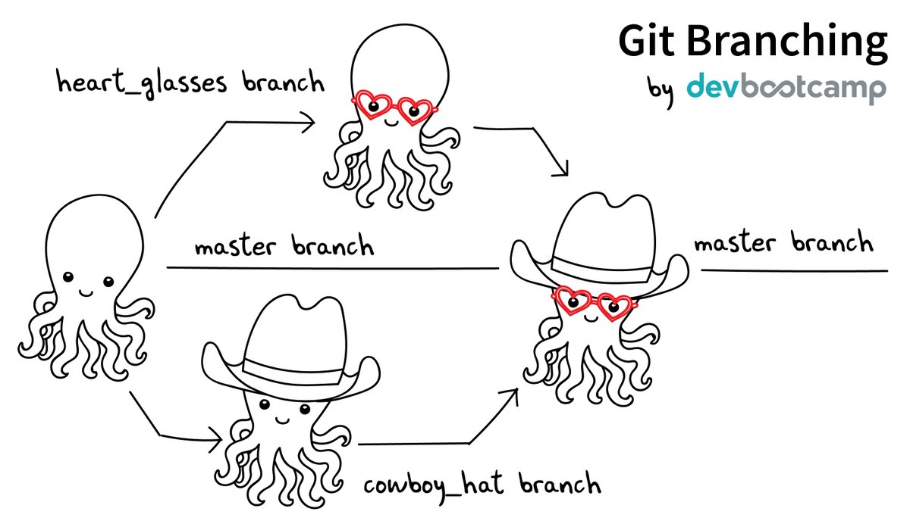
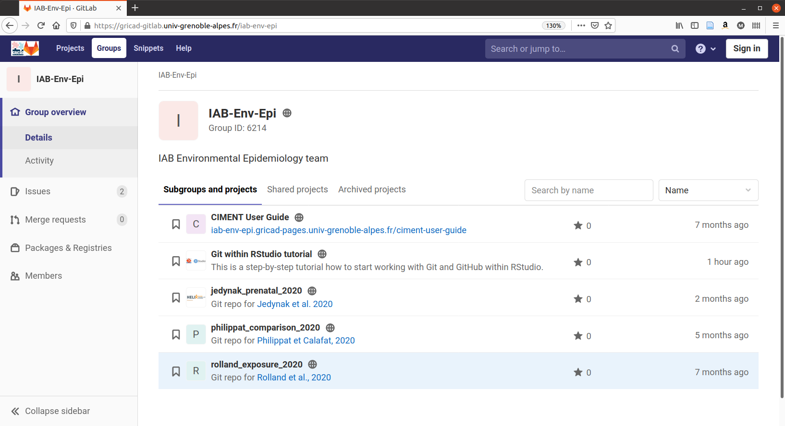

<!--
Notes for next time:
* ajouter un passage sur le R2
-->

```{r message = FALSE, warning = FALSE, echo = FALSE}
library(tidyverse)
library(see)
library(knitr)
library(kableExtra)
library(patchwork)
library(ggforce)
library(grid)
library(broom)
library(performance)
library(xaringanthemer)
```

```{r setup, include=FALSE}
options(htmltools.dir.version = FALSE)
knitr::opts_chunk$set(echo = FALSE, message = FALSE, warning = FALSE)

```

```{r xaringan-themer, include=FALSE, warning=FALSE}
style_mono_accent(
  base_color = "#f26248",
  header_font_google = google_font("Montserrat"), #Amatic SC #Neucha
  text_font_google   = google_font("Pangolin", "300", "300i"),
  code_font_google   = google_font("Fira Mono"),
  title_slide_text_color = "#f28a81"
)
```

<!-- Goal of this presentation: not to teach you git but to make you want to learn it -->
<!-- I am a biostatistician in a scientific research team, so the presentation I will make will reflect this very practical use -->

---

# Git

 <!-- Disclaimer I am not an expert, I am not a software developer, I am a statistician in a research lab, I mainly do data analysis and paper writing -->

* Version control system 
* Repository (repo) = data, figures, reports, and... source code 
* Collaboration <!-- utile même pour soi même quand on travaille avec plusieurs ordi -->
* Sharing code <!-- de plus en plus utile dans la communauté scientifique -->
* Free and open source
* Command line tool but fully integrated in Rstudio

<!-- Most popular version control control system -->
<!-- Records changes made over time in a special data base called a repository -->
<!-- Like the word track change option but 10 times more powerful -->

<!-- Its original purpose was to help groups of developers work collaboratively on big software projects. -->
<!-- developed by Linus Torvald the developer of Linux, developed git to be able to develop linux -->

<!-- It enables you to see your project history and who has made change when and why -->
<!-- And if you make a mistake you can always switch your project back to an earlier state -->


--

# GitHub/GitLab

* Online hosting platforms for a Git-based project
* Remote repo  <!-- very useful even when working solo on a project -->
* User friendly web interface <!-- Especially useful when sharing code -->
* Special features
  * Issues
  * Pull-requests

<!--   -->

<!-- They provide a home for your Git-based projects on the internet. -->
<!-- Like DropBox but to the power 10 -->
<!-- It allows other people to see your stuff, sync up with you, and perhaps even make changes. -->
<!-- Github is the most popular and gitlab is often used academically for historical reasons -->

---

# Why use Git?

* Reproducibility
* Security
* Sharing
* Collaboration
* Very well integrated in Rstudio

---

# Architecture

A central server, several computers


---

# Vocabulary

`repository...` set of files and folders tracked by git (aka repo)  
`remote.......` online backup of your repo  

---

# Workflow

1. Create a repo / get a local copy of an existing repo
2. Create / modify / delete files from this repo
3. Take snapshots of the repo
4. Save the snapshots
5. Share the snapshots
6. Get other collaborators' modifications on the repo

---

# Main commands

<!-- git developed as a command line tool but you can (nearly) never use them when working in Rstudio -->

`git init.....` creates a new repo   
`git clone....` clones an existing repo   
`git add......` include changes of a file into the next commit (aka staging)   
`git commit...` save changes locally   
`git push.....` uploads commits to the remote repository   
`git pull.....` get updates from the remote repo   

---

# Stage - Commit

<!-- to save modifications of a repo you always have to do the two following steps stage and commit, so I will talk about these two actions as if they were one because in practice that's how it is -->


---

# Commit - Vocabulary

`hash...` unique identifier  
`diff...` difference between two versions of the same file  

--

**Important to take time on commit comments!!**

---

# Push - Pull


---

# Branches

Allow for trial and error while maintaining a functional version


---

# Branches - Vocabulary

`master branch...` clean and functional version of the code  
`merge...........` including modifications from a dev branch to the master branch  
`conflict........` happens when lines of code differ between two merged branches  

---

# Branches



---


---

# Git in team env-epi

* Each engineer, researcher, post-doc, etc has their account
* Team account to share publication code: https://gricad-gitlab.univ-grenoble-alpes.fr/iab-env-epi



---

# Useful links

* Great resource on all day to day uses, problems and diagnostics of git with R: https://happygitwithr.com/
* Goog presentation in French: https://www.slideshare.net/VincentGuyader/git-rstudio-vincent-guyader
* Preprint paper on using git with R: https://doi.org/10.7287/peerj.preprints.3159v2
* In depth youtube tutorial on Git: https://www.youtube.com/watch?v=8JJ101D3knE

---

Thanks :)  

<!-- Transition to Pau  -->

<!-- 
Now the bad news: Git was built neither for the exact usage described here, nor for
broad usability. You will undoubtedly notice this, so it's best to know in advance. Happily,
there are many helpful tools that mediate your interactions with Git. GitHub itself is a
ne example, as is RStudio (RStudio Integrated Desktop Environment n.d.). In addition
to pointing out tools that soften Git's sharpest edges, I recommend specic habits and
attitudes that reduce frustration.
-->

<!-- Show: -->

<!-- Init, clone, stage, commit, push, pull, diff, history -->

